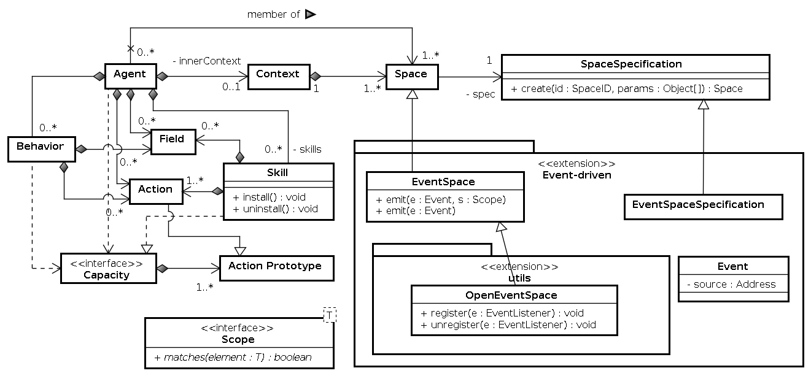
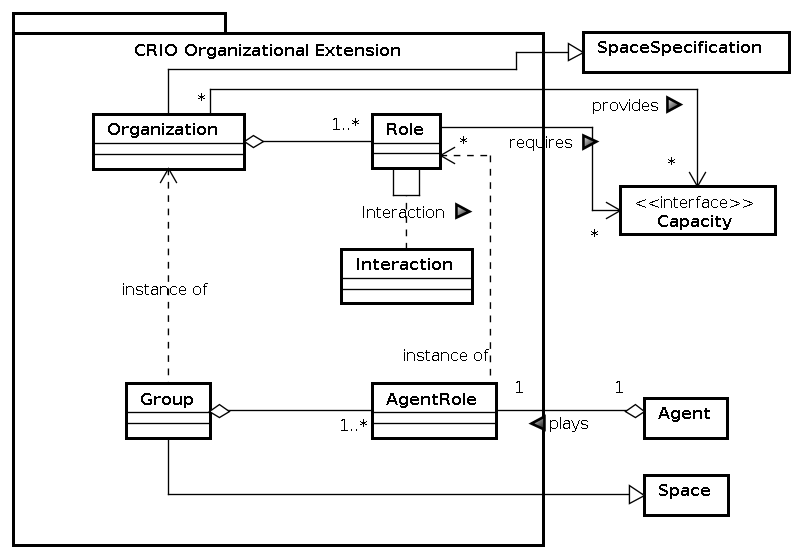
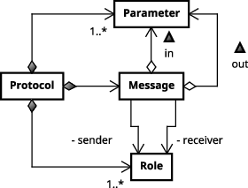
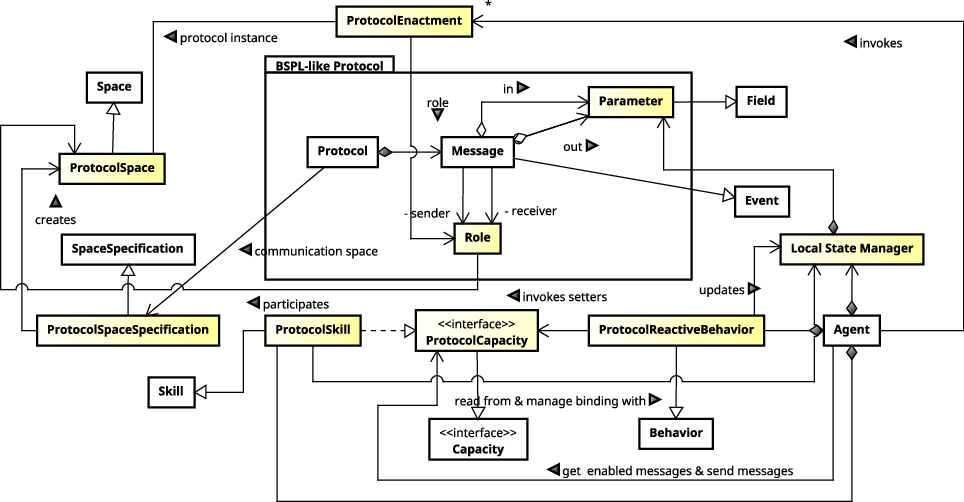
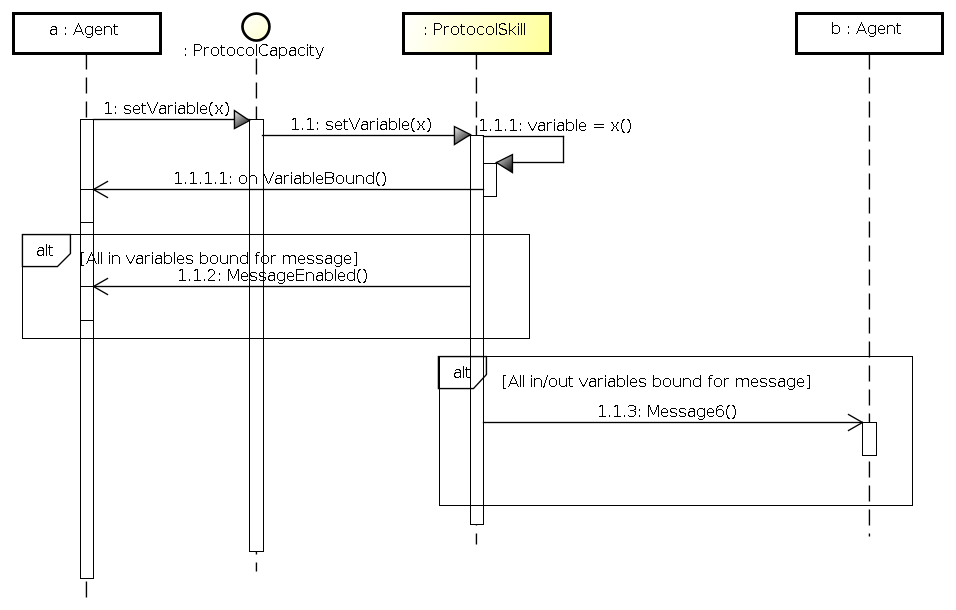
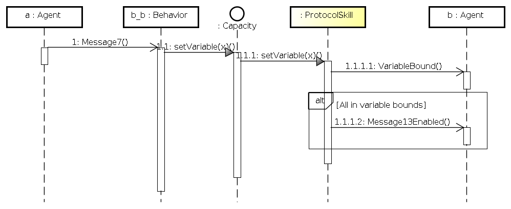

# sarl-protocols
Implementation of protocols in SARL

## SARL Metamodel

The main SARL metamodel is:

## Relation between SARL and CRIO/ASPECS metamodels

The relations between the SARL main metamodel and the concepts that are defined in the CRIO/ASPECS metamodel may be described as:

## BSPL-like Specification

This projects aims at integrating the concept of protocol in a multiagent system coded with SARL.
BSPL was selected as a source of inspiration for the definition of the protocol concepts.
The variant of the BSPL metamodel that is used in this project is:

## Relation between SARL and BSPL-like Specification

The relations between the SARL concepts and those from BSPL-like specification are below.
The concepts that are drawn with a yellow background are those that need to be implemented in SARL for implementing the protocol (see next section).

Some concepts have been implemented independently of any protocol: `ProtocolSpace`, `ProtocolEnactment`.

Some concepts have been implemented with a generic part (independent of any protocol) and protocol-specific part: `ProtocolRole`.

Some concepts are implemented as protocol-specific: `ProtocolCapacity`, `ProtocolSkill`, `ProtocolBehavior`, `Message`, `Variable`, `VariableBound`.

## Operational Semantic of the Protocol Model

The protocol model that is implemented with SARL follows the following operational semantics.

Let agent a updating its knowledge, i.e. a variable, that is associatedd to the protocol.
For updating this knowledge, it invokes `setVariable`.
This function is implemented by an agent capacity/skill that is dedicated to this protocol.
The variable value is stored in the protocol skill and the agent is notified with `VariableBound` event when the variable is bound.

When all the in variables for a message are bound, the agent is notified with `MessageEnabled` event.

When all the in and out variables for a message are bound, the message is automatically emitted to the partner(s) in the protocol.

When an agent is receiving a message in the context of a protocol, the corresponding event handler is implemented in the protocol behavior.
This behavior is in charge of updating the agent's knowledge with data coming from the incoming event.

According to the operational semantics that were previously defined, this update of knowledge may cause the firing of `VariableBound`, `MessageEnabled` events in the agent.
It may also cause the sending of another message in the context of the protocol if all the variables are bound.

## Transformations from BSPL-like specification to SARL

See the translation rules from BSPL-like specification to SARL in [this file](TRANSLATION_RULES.md).
